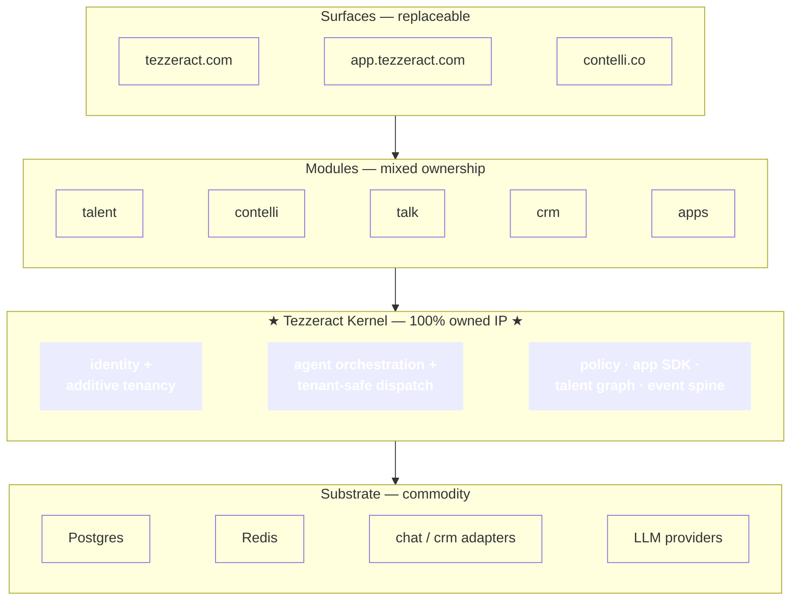
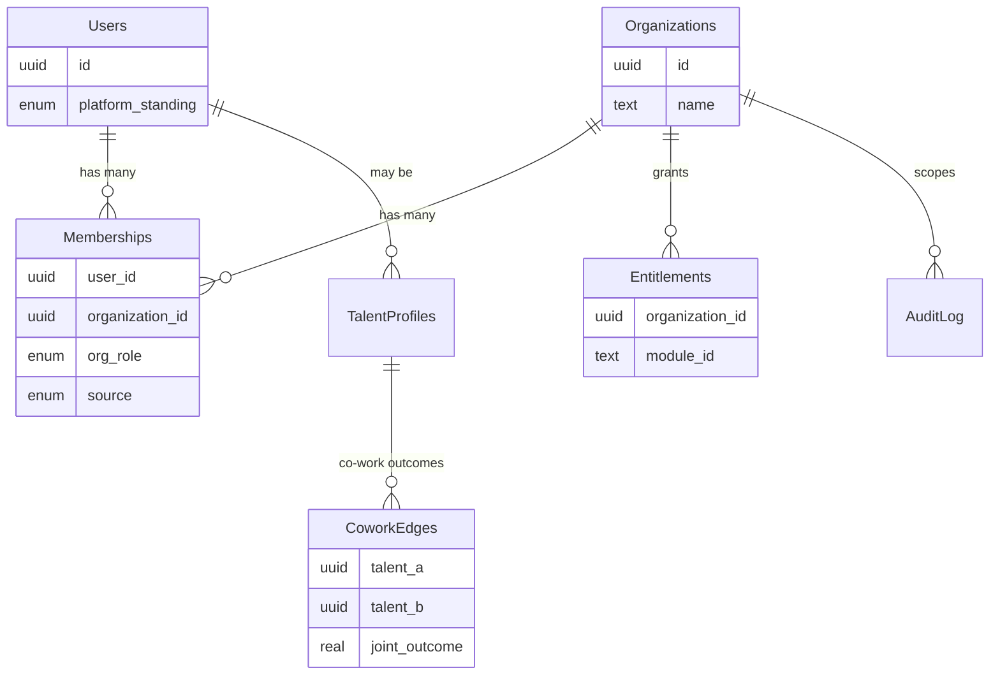
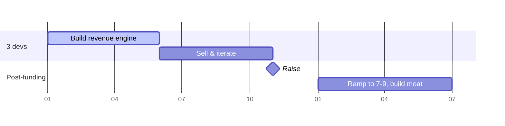

# Tezzeract Architecture — One Page

> The whole architecture, current as of 2026-07-26. Read this first; follow links for depth.
> Full map: [README.md](README.md).

---

## What we're building

Tezzeract discovers talent and forms remote teams, sold as a subscription giving a business
both a **workforce on demand** and a **modular AI-fronted toolset** to run it. Revenue is
team augmentation: **$3k / 3-person · $5k / 5-person · $10k+ enterprise**, monthly.

## The organising idea: the Kernel



**Zero copyleft in the Kernel. No Kernel→module dependency. Substrate only via interfaces.**
All three CI-enforced — that boundary is the IP story. → [30](technical/30-architecture-v2.md) · [31](technical/31-ip-strategy.md)

## Six decisions everything follows from

1. **Additive org membership, not context switching.** A user in two orgs sees both at once,
   labelled. Reads are a union (`organization_id = ANY(orgIds)`); writes name their target
   org. There is deliberately **no "current organization"** in session state.
   → [02](02-identity-and-tenancy.md) · [12](technical/12-data-model.md)

2. **`organizationId` is unrepresentable as a model input.** Injected server-side into a
   pre-scoped DB handle. A model that can *name* an org can exfiltrate across tenants — so it
   must not be able to name one. → [14 §7](technical/14-agent-runtime.md)

3. **Modules are independently sellable apps**, not feature folders. Same package renders
   standalone and in the shell. Cross-module imports fail CI. → [01](01-platform-topology.md) · [15](technical/15-api-and-modules.md)

4. **Zod is the single contract source** → runtime validation + OpenAPI + typed client +
   agent tool definitions. Four hand-maintained copies would drift. → [ADR-009](technical/10-decisions.md)

5. **Upstream open-source runs headless**, behind adapters, unmodified, on a private
   network. Keeps AGPL at arm's length and makes substrate replaceable.
   → [24](technical/24-headless-integration.md) · [33](technical/33-substrate-strategy.md)

6. **The moat is `graph.cowork_edges`** — who delivered successfully together. Unscrapeable,
   compounds per placement. Instrument from the first placement. → [32](technical/32-talent-graph.md)

## Stack

| Layer | Choice | Note |
|---|---|---|
| Repo | pnpm + Turborepo monorepo | + separate `tezzeract-infra`, `tezzeract-marketing` |
| Public web | Next.js | marketing owns it; **zero platform secrets** |
| App shells | Vite + React SPA | shared `@tezzeract/ui` |
| Backend | **Express now → NestJS at ~5 engineers** | logic in framework-free `*.service.ts` |
| Contracts | Zod → OpenAPI + client + tools | |
| Database | One Postgres, schema per module, RLS | `organization_id` on every tenant row |
| Vectors | pgvector, org-partitioned namespaces | pre-filter, never post-filter |
| Identity | Supabase Auth behind Tezzeract Identity | the IdP-swap seam |
| Agent | Own orchestrator; provider-agnostic | routed by data class |
| Hosting | Vercel (web) · Fly (services) · Supabase | EU-first |

## Core schema

```sql
platform.users          + platform_standing (5 Tezzeract levels)
platform.organizations  (no user_id — that's the blocker in today's schema)
platform.memberships    (user × org × org_role × source)   ← everything depends on this
platform.entitlements   (org × module) ← also the app-store install mechanism
platform.audit_log      append-only, cross_org flagged
graph.cowork_edges      ★ the moat
```

Two orthogonal role axes: **platform standing** on the user, **org role** on the membership.



## Where we are

| | Status |
|---|---|
| Talent module | ~40% — AI chat, cards, team panel, Cal.com booking |
| Contelli (`social`) | Working — OAuth, scheduling, dashboards. **Not in the priority list; needs a decision** |
| Talk / Tasks / CRM | Not started (WhatsApp/Slack manual in the interim) |
| Kernel | Not started |

## The plan



Pre-funding scope = marketplace + talent ops + billing/accounts. Everything else deferred.
→ [40](technical/40-revenue-first-plan.md)

## 🔑 Five things that are cheap now and expensive later

| Do in M0 | Cost now | Cost at month 12 |
|---|---|---|
| `memberships` table (drop `organizations.user_id`) | 2 days | Weeks, downtime, live customers |
| `organization_id` + index + RLS on every tenant table | hours | Every query retrofitted |
| **Outcome instrumentation** | 2 days | **Unbuyable — 15 months of data lost** |
| Contributor IP assignment + CLA bot | 1 week | Chasing past contributors, no leverage |
| `audit_log` write path | 1 day | No compliance history |

Row 3 ships no feature and nobody notices — and it's worth more at month 18 than anything
else that quarter, because placements accrue in calendar time.

## 🔴 Three blockers

1. **Live Supabase `service_role` key committed** — [SUPABASE_SETUP_GUIDE.md:48](../../SUPABASE_SETUP_GUIDE.md), [server/ENV_SETUP.md:16](../../server/ENV_SETUP.md). Bypasses RLS entirely. Rotate + purge history.
2. **Contributor IP assignment unaudited** — external "Associate/Pro" contributors without signed assignment is the likeliest deal-blocker.
3. **AGPL ruling pending counsel** — blocks the chat substrate decision only; CRM and Tasks are decided (build native).

## Non-negotiables

1. Modules stay independently sellable — CI-enforced
2. One identity, everywhere
3. Org membership is additive, never exclusive
4. Tenant isolation is structural, never prompted
5. Every module capability is agent-callable
6. Shared components by default
7. The API is designed for agent retrieval, not only human REST aesthetics
